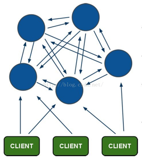
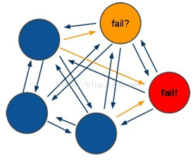

# 4 Redis集群

## 4.1 Redis集群原理

### 4.1.1 Redis Cluster架构图

  

(1)所有的redis节点彼此互联(PING-PONG机制),内部使用二进制协议优化传输速度和带宽。  
(2)节点的fail是通过集群中超过半数的节点检测失效时才生效。  
(3)客户端与redis节点直连,不需要中间proxy层.客户端不需要连接集群所有节点,连接集群中任何一个可用节点即可。  
(4)redis-cluster把所有的物理节点映射到[0-16383]slot上(哈希槽),cluster 负责维护Redis集群中内置了16384个哈希槽，当需要在Redis集群中放置一个key-value时，redis先对key使用crc16算法算出一个结果，然后把结果对16384求余数，这样每个key都会对应一个编号在0-16383之间的哈希槽，redis会根据节点数量大致均等的将哈希槽映射到不同的节点。

### 4.1.2 Redis Cluster投票:容错

  

如果半数以上master节点与其中一个master节点通信超时(cluster-node-timeout),认为当前master节点挂掉。